# FILE MANIPULATION USING LINUX

## 1. SUDO COMMAND

`sudo` short for `"superuser do"` is a command used in Unix-like operating systems to allow a permitted user to execute commands as the super user. Hence; It is used to perform tasks that require administrative or root permissions.

The general syntax:

```Bash
sudo (command e.g: apt upgrade)
```

It becomes:

```Bash
sudo apt upgrade
```

This command is used to upgrade the installed packages on your system to their latest versions.

- When using `sudo`, the system will prompt users to authenticate themselves with a password.

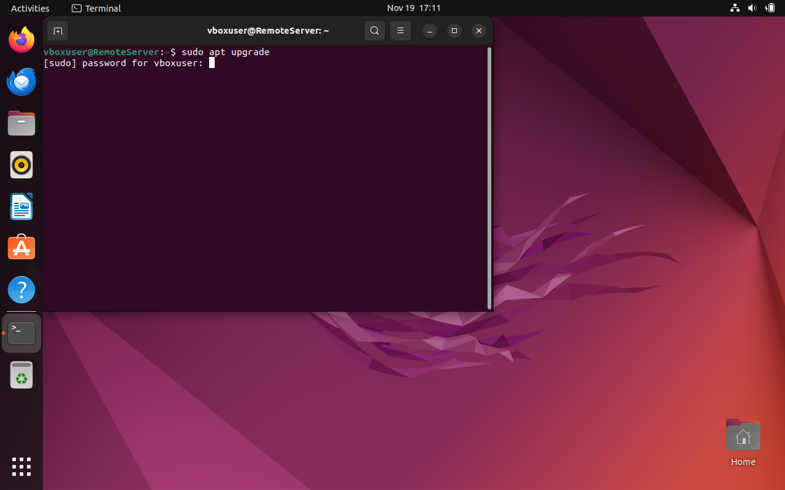

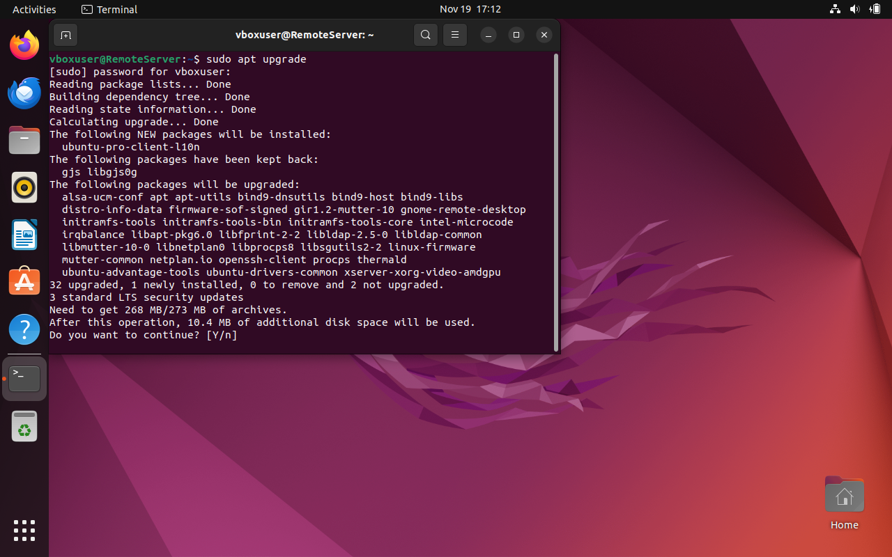

## PWD COMMAND

`pwd` short for `print working directory`, displays the name of the current directory you are in. Simply entering pwd will return the full current path starting with a forward slash (e.g.: /home/ubuntu).
The pwd command uses the following syntax:

```Bash
pwd [option]
```

It has two (2) acceptable options:

- -L: Display the logical current working directory (default behavior).
- -P: Display the physical current working directory (the location of the current directory in the file system, which might differ from the logical directory due to symbolic links).

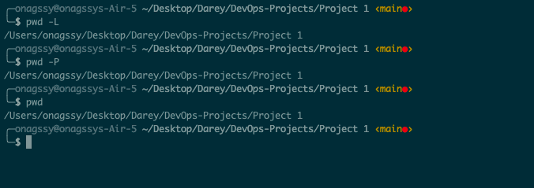

## CD COMMAND

`cd` short for `change directory`, allows you to change directories in Linux. It can be used as follows:

To change to a specific directory:

```Bash
cd /path/to/directory
```

To move up one level in the directory hierarchy:

```Bash
cd ..
```

To go to your home directory:

```Bash
cd ~
```

To quickly return to the previous directory (where you were before the last cd):

```Bash
cd -
```

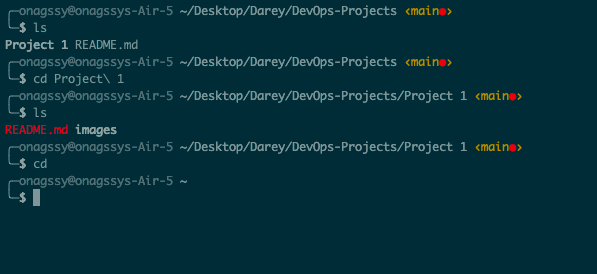

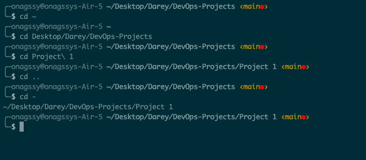

## LS COMMAND

`ls` short for `list`, is used to display files and folders within a specified location. It displays all of the contents in a directory.
If you are in a directory and you want to view its content, simply do `ls` like this e.g::

```Bash
ls
```

or you can simply specify the path to the folder to want to view its content.
e.g.:

```Bash
ls ~/Desktop/Darey/DevOps-Projects/Project\ 1
```


You can also use this to list all the files in the sub-directories:

```Bash
ls -R
```

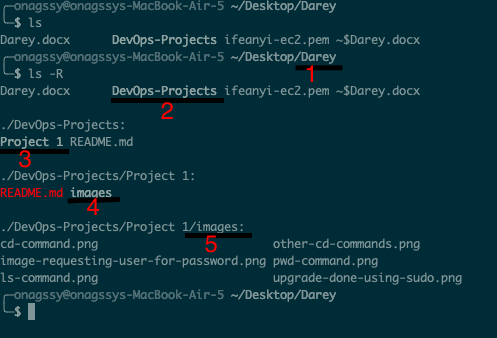

To show hidden files in addition to visible ones:

```Bash
ls -a
```

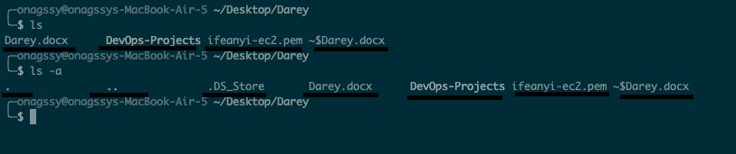

To show files in easily readable formats such as MB, GB and TB.

```Bash
ls -lh
```


## CAT COMMAND

`cat`:- short for `Concatenate` lists, combines, and writes file content to the standard output. To run the command, type cat followed by the file name and its extension.

```Bash
cat file.txt
```

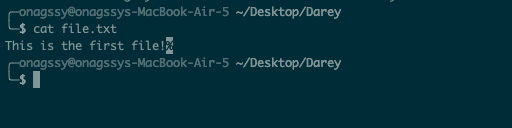

You can also merge two (2) files and store the output in a third file.

```Bash
cat file.txt file1.txt > mergedfile.txt
```

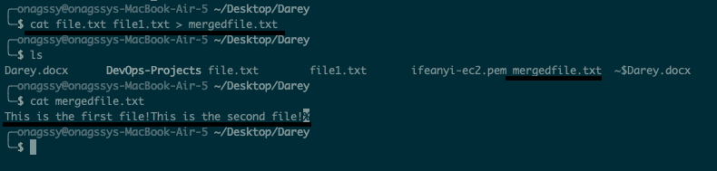
You can see that there is now a third file called `mergedfile.txt` and is has contents from `file.txt` and `file1.txt`.

You can also display the content in reverse order using:

```Bash
tac mergedfile.txt
```

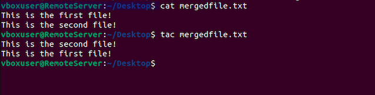

## CP COMMAND

`cp` short for `copy` is used to copy files or directories from one location to another.
The basic syntax is:

```Bash
cp [options] source destination
```

- source: The file or directory you want to copy
- destination: Where you want to put the copied file(s) or directory.

1.  To copy a file to a different location:

```Bash
cp file.txt /path/to/destination/
```

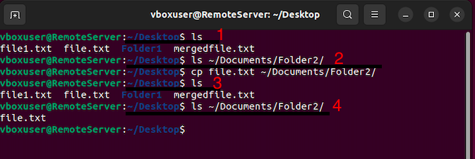

Take note of the command at number 2 in the image above, you can see that after listing the content in Folder2 nothing was returned. You can see that after the cp command we now have file.txt in Folder2 as seen in number 4.

**Note that:** You can also copy multiple files to a directory using the same format above e.g:

```Bash
cp file.txt file1.txt /path/to/destination/
```

2. Copy a directory and its contents to a different directory/location:

```Bash
cp -r directory/ /path/to/destination/
```

The -r (or -R) option is used to copy directories recursively.
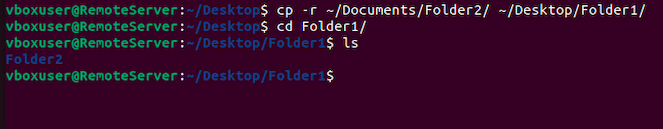

3. Preserve the original file attributes (timestamps, permissions):

```Bash
cp -p file.txt /path/to/destination/
```

The -p option preserves the specified attributes.

4. Force copy, overwrite destination if it exists:

```Bash
cp -f file.txt /path/to/destination/
```

The -f option forces the copy, overwriting the destination if it exists.

5. Interactive copy, prompt before overwriting:

```Bash
cp -i file.txt /path/to/destination/
```

The -i option prompts for confirmation before overwriting.

6. Copy all files in a directory to another directory:

```Bash
cp source_directory/* /path/to/destination/
```

This copies all files in source_directory to the specified destination.

## MV COMMAND

`mv` short for `move` is used to move and rename files and directories.  
**Note that**: it does not produce an output upon execution.

`Syntax`:  
Simply type mv followed by the filename and the destination directory. E.g:

```Bash
mv file.txt /home/ubuntu/Commands
```

You can also use the mv command to rename a file. E.g:

```Bash
mv file1.txt file2000.txt
```

## MKDIR COMMAND

`mkdir` short for `make directory` - is used to create one or multiple directories at once and set permissions for each of them.  
**Note that**: the user executing this command must have the privilege to make a new folder in the parent directory or they may receive a permission denied error.  
**Syntax**:

```Bash
mkdir [option] directory_name
```

Example:

1. Create a directory called "Music"
2. Create a directory called "Songs" inside "Music"

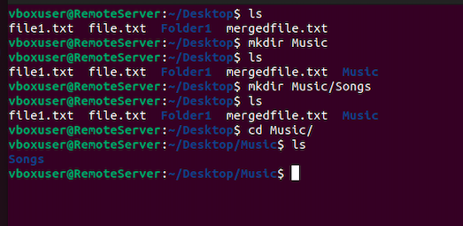

The `mkdir` command support many options such as: -  
`-p`: short for `parent` - this creates a directory between two existing folders e.g:

```Bash
mkdir -p Music/2020/Songs
```

The above command will make the new "2020" directory.  
`-m`: sets the file permissions.
For instance; to create a directory with full read, write and execute permissions for all users, enter:
mkdir -m777 directory_name  
`-v`: prints a message for each created directory.

## RMDIR COMMAND

`rmdir` short for `remove directory` - is used to permanently delete an empty directory.  
**Note that:** to do this the user running this command should have sudo privileges in the parent directory.

For example: if you want to remove an empty subdirectory named personal1 and its main folder mydir.

```Bash
rmdir Person/personal1
```

## RM COMMAND

This is used to delete files within a directory.

```Bash
rm file.txt
```

To remove multiple files:

```Bash
rm file1.txt file2.txt file3.txt
```

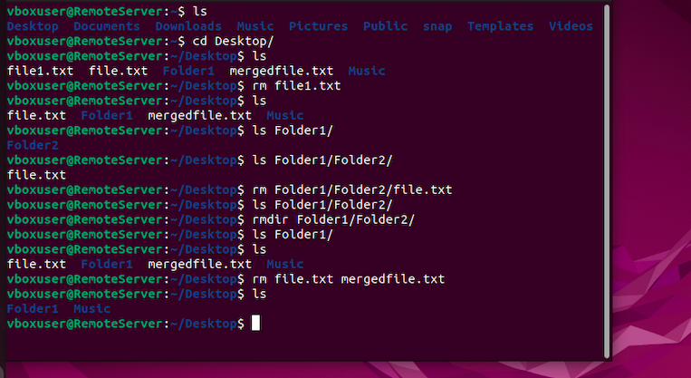

Some acceptable option you can add:  
`-i`: prompts system confirmation before deleting a file.  
`-f`: allows the system to remove without a confirmation.  
`-r`: deletes files and directories recursively.

## TOUCH COMMAND

This command allows you to create an empty file or generate and modify a timestamp in the Linux Command Line.  
Lets create an html file named index.html in the Desktop directory.

```Bash
touch index.html
```

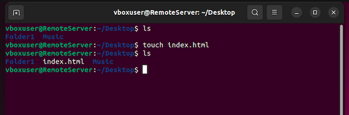

## LOCATE COMMAND

This command is used to search for a file or a directory.  
Adding the -i argument will turn off case sensitivity, so you can search for files even if you don't remember its exact name.  
Or you can say: It is used to quickly locate the path of a file or directory based on its name.  
Syntax:

```Bash
locate filename
```

The above command searches for the specified filename and prints the path(s) where it is located.

If you add the -i option, it makes the search case-insensitive:

```Bash
locate -i filename
```

## FIND COMMAND

It is used for searching and locating files and directories based on various criteria.
The basic syntax of the find command is as follows:

```Bash
find [path] [options] [expression]
```

`-path`: The starting directory for the search. If not specified, it defaults to the current directory.  
`-options`: Various options that modify the behavior of the find command.  
`-expression`: Specifies the search criteria.  
Some examples of using the find command:

```Bash
find /path/to/search -name filename
```

Basic usage:

```Bash
find /path/to/search -name filename
```

This command searches for files and directories with the specified name (filename) under the specified path (/path/to/search).

Search for Files Modified in the Last N Days:

```Bash
find /path/to/search -mtime -7
```

This command searches for files modified within the last 7 days.

Search for Files of a Specific Type:

```Bash
find /path/to/search -type f -name "*.txt"
```

This command searches for regular files with names ending in ".txt".

Search for Directories:

```Bash
find /path/to/search -type d -name "dirname"
```

This command searches for directories with the specified name (dirname).

Search for Files Matching Multiple Criteria:

```Bash
find /path/to/search -type f -name "*.txt" -mtime -7
```

This command searches for regular files with names ending in ".txt" modified within the last 7 days.

## GREP COMMAND

## DF COMMAND

It is used to display information about the amount of disk space available and used on file systems.
The basic syntax of the df command is:

```Bash
df [options] [file system(s)]
```

1. Display Disk Space Usage for All File Systems:

```Bash
df
```

This command displays information about disk space usage for all mounted file systems.

2. Display Disk Space Usage in Human-Readable Format:

```Bash
df -h
```

The -h option provides a human-readable output, showing sizes in kilobytes (KB), megabytes (MB), gigabytes (GB), etc.

3. Display Disk Space Usage for a Specific File System:

```Bash
df /dev/sda1
```

Replace /dev/sda1 with the specific file system you want to check.

## DU COMMAND

The du command is used to estimate the disk space used by files and directories.

The basic syntax of the du command is:

```Bash
du [options] [file(s) or directory]
```

Here are some common examples of using the du command:

1. Display Disk Usage for a Directory:

```Bash
du /path/to/directory
```

This command displays the disk space usage for the specified directory.

2. Display Disk Usage in Human-Readable Format:

```Bash
du -h /path/to/directory
```

The -h option provides a human-readable output, showing sizes in kilobytes (KB), megabytes (MB), gigabytes (GB), etc.

3, Display Total Disk Usage for Multiple Directories:

```Bash
du -h --max-depth=1 /dir1 /dir2
```

The --max-depth option limits the depth of the directory tree shown. In this example, it limits the output to the top-level directories.

4. Display Disk Usage for All Files in a Directory:

```Bash
du -h --max-depth=1 /path/to/directory/*
```

This command displays the disk space usage for all files directly under the specified directory.

5. Sort Output by Size:

```Bash
du -h --max-depth=1 /path/to/directory | sort -rh
```

This command sorts the output by size in descending order using the sort command.

6. Display Only the Total Disk Usage:

```Bash
du -sh /path/to/directory
```

The -s option provides a summary, showing only the total disk usage.

7. Display Disk Usage for Each Subdirectory Separately:

```Bash
du -h --max-depth=1 --separate-dirs /path/to/directory
```

The --separate-dirs option displays the disk space usage for each subdirectory separately.

## HEAD COMMAND

The head command is used to display the first part of a file.

## TAIL COMMAND

The tail command is used to display the last part of a file.

## DIFF COMMAND

The `diff` command is used to compare two files and display the differences between them.

## TAR COMMAND

The name `tar` stands for "tape archive," reflecting its historical use for backing up files to tape drives. The tar command is commonly used to create, manipulate, and extract archive files in various formats.
It archives multiple files into a TAR file. It is similar to ZIP with optional compression.

The basic syntax of the tar command is:

```Bash
tar [options] archive_name files/directories
```

Here is an example using the tar command:

1. Create a Tar Archive:

```Bash
tar -cvf archive.tar file1 file2 directory
```

This command creates a new archive named archive.tar containing file1, file2, and the contents of the directory.

# FILE PERMISSIONS AND OWNERSHIP

## CHMOD COMMAND

The `chmod` command is used to change the `READ`, `WRITE` and `EXECUTE` permissions of a file or directory.
In Linux, each file is associated with three (3) user classes - owner, group member and others. The name "chmod" stands for "change mode." .

Here is the basic syntax:

```Bash
chmod [option] [permission] [file_name]
```

**Note:** .  
<ins>Alphabetic Symbols:</ins>  
u: User/owner  
g: Group  
o: Others
a: All (equivalent to ugo)

<ins>Permission types:</ins>  
r: Read   
w: Write  
x: Execute 

<ins>Mathematical Operations:</ins> .   
+: Adds the specified permission  
-: Removes the specified permission
=: Sets the specified permission and removes others.

**Examples:**  
Adding Permissions:   
1. Add execute permission for the owner:
```Bash
chmod +x filename
```
This adds execute permission for the owner of the file.

2. Add read and write permissions for the group:
```Bash
chmod g+rw filename
```
This adds read and write permissions for the group.

3. Add execute permission for all (user, group, others):
```Bash
chmod a+x filename
```
This adds execute permission for everyone.

Removing Permissions:
1. Remove write permission for others:
```Bash
chmod o-w filename
```
This removes write permission for others.

2. Remove read and execute permissions for the group:
```Bash
chmod g-rx filename
```
This removes read and execute permissions for the group.

Using Mathematical Operations:
1. Add read and write permissions for the owner, and remove all permissions for others:
```Bash
chmod u=rw,go= filename
```
This sets read and write permissions for the owner and removes all permissions for the group and others.

2. Combine permissions using mathematical operations:
```Bash
chmod u+r,g+w,o-x filename
```
This adds read permission for the owner, write permission for the group, and removes execute permission for others.

The `chown` command is used to change the ownership of files and directories. The name "chown" stands for "change owner." The basic syntax of the chown command is:
```Bash
chown [options] owner[:group] file(s)
```

`options`: Various options that modify the behavior of the chown command.   
`owner`: The new owner of the file(s).   
`group`: The new group owner of the file(s). If not specified, the group remains unchanged.   
`file(s)`: The file or files for which you want to change the ownership.

Here are some common examples of using the chown command:

1. Change the Owner of a File:
```Bash
chown newowner filename
```
This command changes the owner of filename to newowner.

2. Change the Owner and Group of a File:

```Bash
chown newowner:newgroup filename
```
This command changes both the owner and group of filename to newowner and newgroup, respectively.

3. Change the Owner and Recursively Apply to a Directory:
```Bash
chown -R newowner:newgroup /path/to/directory
```
The -R option recursively changes ownership for the specified directory and its contents.

4. Change Only the Group of a File:
```Bash
chown :newgroup filename
```
This command changes only the group of filename to newgroup.

5. Change the Owner of All Files in a Directory (No Recursion):

```Bash
chown newowner /path/to/directory/*
```
This command changes the owner of all files directly under directory.

## JOBS COMMAND
The `jobs` command is to display a list of jobs that are currently running in the background or suspended in the background. It is commonly used in conjunction with the job control features provided by the shell, such as those in Bash.

Here are some basic uses of the jobs command:   
1. List Background Jobs:
```Bash
jobs
```
This command displays a list of background jobs along with their job numbers and statuses.

2. Bring a Job to the Foreground:
```Bash
fg %1
```
If you have a job with the job number 1 running in the background, the fg command brings it to the foreground.

3. Send a Job to the Background:
```Bash
bg %2
```
If you have a job with the job number 2 suspended, the bg command sends it to the background to continue running.

4. Suspend a Foreground Job:
Press Ctrl + Z to suspend the currently running foreground job.

5. Resume a Suspended Job:
```Bash
bg %1
```
This command resumes the job with job number 1 in the background.

6. Foreground a Background Job:
```Bash
fg %3
```
Brings the background job with job number 3 to the foreground.

## KILL COMMAND
The kill command is used to terminate or send signals to processes. The name "kill" can be a bit misleading, as the primary purpose of the command is to send signals to processes, which can include signals that gracefully terminate a process. 

To kill a program you must know its process identification number (PID). If you don't know the PID, run the following command. 
```Bash
ps ux
```
The basic syntax of the kill command is:
```Bash
kill [options] <PID>
```
`options`: Various options that modify the behavior of the kill command.   
`<PID>`: The process ID of the target process.

Here are some common examples of using the kill command:

1. Terminate a Process (default signal is SIGTERM):
```Bash
kill <PID>
```
This command sends the default termination signal (SIGTERM) to the process with the specified process ID. 

2. Forcefully Terminate a Process (SIGKILL signal):
```Bash
kill -9 <PID>
```
The -9 option sends the SIGKILL signal, which forcefully terminates the process.

3. List Available Signals:
```Bash
kill -l
```
This command lists the available signals and their corresponding numbers.

## PING COMMAND
The ping command is used for checking whether a network or a server is reachable. In addition, it is used to troubleshoot various connectivity issues. 

The basic syntax of the ping command is:
```Bash
ping [options] host
```
`options`: Various options that modify the behavior of the ping command.   
`host`: The host or IP address of the destination.   
Here are some common examples of using the ping command:
1. Basic Ping:
```Bash
ping google.com
```
This is used to know if you can connect to google and measure its response time.

## WGET COMMAND
The wget command is a powerful utility used for downloading files from the internet in Unix-like operating systems, including Linux and macOS. It supports both HTTP, HTTPS and FTP protocols and can retrieve files from web servers and FTP servers. The basic syntax of the wget command is:
```Bash
wget [options] [URL]
```
`options`: Various options that modify the behavior of the wget command.    
`URL`: The URL of the file or resource to download.

Here are some common examples of using the wget command:
1. Download a File:
```Bash
wget http://example.com/file.txt
```
This command downloads the file file.txt from the specified URL.

2. Download a File and Save with a Different Name:
```Bash
wget -O localfile.txt http://example.com/file.txt
```
The -O option allows you to specify the local filename.


3. Download a File in the Background (in the background, allowing you to continue using the terminal):
```Bash
wget -b http://example.com/largefile.zip
```
This command runs wget in the background.

4. Download Multiple Files:
```Bash
wget http://example.com/file1.txt http://example.com/file2.txt
```
You can specify multiple URLs to download.

## UNAME COMMAND
The uname command is used to display system information. The name "`uname`" stands for "`Unix name`." The basic syntax of the uname command is:
```Bash
uname [options]
```
Here are some common examples of using the uname command:

1. Display System Name:

```Bash
uname -s
```
This command displays the system name.

2. Display Node Name (Hostname):

```Bash
uname -n
```
This command displays the node name, which is typically the hostname of the machine.

3. Display Kernel Release:

```Bash
uname -r
```
This command displays the kernel release.

4. Display Kernel Version:

```Bash
uname -v
```
This command displays the kernel version.

5. Display Machine Hardware Name:
```Bash
uname -m
```
This command displays the machine hardware name.

6. Display Processor Type:

```Bash
uname -p
```
This command displays the processor type.

7. Display Operating System:

```Bash
uname -o
```
This command displays the operating system.

8. Display All Information:
```Bash
uname -a
```
This command displays all available information, including system name, node name, kernel release, kernel version, machine hardware name, and processor type.

## TOP COMMAND
The top command in Unix-like operating systems, including Linux and macOS, is a real-time system monitoring tool that provides an interactive, dynamic view of system resource usage. It displays a list of processes and their resource utilization, including CPU, memory, and swap usage. The top command continuously updates the information on the screen, allowing you to monitor system performance in real time.

Here's a basic overview of using the top command:

1. Run the top Command:
Open a terminal and simply type:

```Bash
top
```
This will launch the top command, displaying a real-time view of system information.

2. Interact with the top Interface:

- Use arrow keys to navigate through the processes.   
- Press `'q'` to quit the `'top'` command.

3. Sort Processes by Different Criteria:

- Press P to sort processes by CPU usage (default).
- Press M to sort processes by memory usage.

4. Change the Update Interval:
- Press s to enter the setup screen.
- Use arrow keys to navigate to the "Update time" field.
- Enter a new update interval in seconds.
5. Filter Processes:
- Press U to enter the setup screen.
- Use arrow keys to navigate to the "Filter by user" field.
- Enter a username to filter processes by a specific user.

6. Highlight Running Processes:
- Press z to highlight running processes.

7. Kill a Process:
- Press k to kill a process. Enter the process ID (PID) when prompted.

8. Display Full Command Path:
- Press c to display the full command path of processes.

9. Toggle Summary Information:
- Press t to toggle the summary information section.

10. View Help:   
- Press h to display a help screen with a list of available commands.

## HISTORY COMMAND
The `history` command is used to display a list of commands previously entered by the user in the terminal. It provides a record of recently executed commands, along with their line numbers, which can be useful for recalling and re-executing commands. The basic syntax of the history command is:
```Bash
history [options]
```
Here are some common examples of using the history command:

1. Display Command History:
```Bash
history
```
This command displays the entire command history, showing each command along with its line number.

2. Display a Specific Number of Commands:

```Bash
history 10
```
This command displays the last 10 commands in the history.

3. Search Command History:
```Bash
history | grep "keyword"
```
This command searches the command history for commands containing the specified keyword.

4. Execute a Command from History by Line Number:
```Bash
!15
```
This command re-executes the command with line number 15 from the history.

5. Execute the Last Command:
```Bash
!!
```
This command re-executes the last command in the history.

6. Execute a Command Matching a Prefix:

```Bash
!ls
```
This command re-executes the most recent command in the history that starts with "ls".

7. Clear Command History:
```Bash
history -c
```
This command clears the entire command history.

8. Suppress Command Numbers:
```Bash
history -w
```
This command writes the current history to the history file without command numbers.

9. Append Commands to the History File:
```Bash
history -a
```
This command appends the current session's commands to the history file.


## MAN COMMAND
The man command in Unix-like operating systems is used to display the manual pages (documentation) for various commands, utilities, and system functions. The name "man" stands for "manual." The basic syntax of the man command is:

```Bash
man [options] command
```
- `options`: Various options that modify the behavior of the man command.   
- `command`: The name of the command or topic for which you want to view the manual page.

Here are some common examples of using the man command:

1. Display the Manual Page for a Command:

```Bash
man ls
```
This command displays the manual page for the ls command, which is used to list files and directories.

2. Navigate Within the Manual Page:

- Use arrow keys to scroll up and down.
- Press Space to scroll down one page.
- Press q to exit the manual page.

Search for a Keyword Within the Manual Page:
```Bash
man -k keyword
```
This command searches for manual pages containing the specified keyword.

## ECHO COMMAND
The `echo` command is used to display text or variables to the terminal. It is a simple command that outputs the text or value of a variable to the standard output. The basic syntax of the echo command is:
```Bash
echo [options] [text or variables]
```
`options`: Various options that modify the behavior of the echo command.   
`text or variables`: The text or variables whose values you want to display.    
Here are some common examples of using the echo command:
1. Display Text:

```Bash
echo "Hello, World!"
```
This command displays the text "Hello, World!" to the terminal.

2. Display Variables:

```Bash
name="John"
echo "My name is $name"
```
This command defines a variable name with the value "John" and then displays the text "My name is John" using the variable.

3. Display Multiple Lines:

```Bash
echo -e "Line 1\nLine 2"
```
The -e option enables interpretation of backslash escapes, allowing you to display multiple lines.

4. Redirect Output to a File:

```Bash
echo "Output to file" > output.txt
```
This command redirects the output of echo to a file named output.txt.

5. Append to a File:

```Bash
echo "Append to file" >> output.txt
```
The >> operator appends the output to the end of the file.

## ZIP, UNZIP COMMANDS
The zip and unzip commands are used for creating and extracting ZIP archives, respectively. These commands are commonly used for compressing and decompressing files and directories. Here are some examples of using the zip and unzip commands:

`zip` Command:
1. Create a ZIP Archive:

```Bash
zip archive.zip file1.txt file2.txt directory/
```
This command creates a ZIP archive named archive.zip containing file1.txt, file2.txt, and the contents of the directory/.

2. Create a ZIP Archive Recursively:

```Bash
zip -r archive.zip directory/
```
The -r option enables recursive compression, including all files and subdirectories in the specified directory.

3. Add Files to an Existing ZIP Archive:

```Bash
zip archive.zip additionalfile.txt
```
This command adds additionalfile.txt to the existing ZIP archive archive.zip.

4. Create a Password-Protected ZIP Archive:

```Bash
zip -e secured.zip file.txt
```
The -e option prompts for a password during compression, creating a password-protected ZIP archive.

`unzip` Command:
1. Extract Files from a ZIP Archive:

```Bash
unzip archive.zip
```
This command extracts the contents of archive.zip in the current directory.

2. Extract Files to a Specific Directory:

```Bash
unzip archive.zip -d /path/to/destination
```
The -d option specifies the destination directory for extracting files.

3. List Contents of a ZIP Archive:

```Bash
unzip -l archive.zip
```
This command lists the contents of archive.zip without extracting them.

4. Extract Only Specific Files:

```Bash
unzip archive.zip file1.txt file2.txt
```
This command extracts only file1.txt and file2.txt from the ZIP archive.

5. Password-Protected ZIP Archive:

```Bash
unzip secured.zip
```
If the ZIP archive is password-protected, the unzip command prompts for the password.

6. Quiet Mode (Suppress Output):

```Bash
unzip -q archive.zip
```
The -q option suppresses output during extraction.

## HOSTNAME COMMAND
The `hostname` command is used to display or set the system's hostname. The hostname is the label assigned to a device on a network to uniquely identify it. The basic syntax of the hostname command is:
```Bash
hostname [options] [newhostname]
```
- `options`: Various options that modify the behavior of the hostname command.
- `newhostname`: The new hostname to set (if provided).

Here are some common examples of using the hostname command:

1. Display the Current Hostname:
```Bash
hostname
```
This command displays the current hostname of the system.

2. Display the Fully Qualified Domain Name (FQDN):

```Bash
hostname -f
```
The -f option displays the fully qualified domain name.

3. Set a New Hostname (Temporary):

```Bash
hostname newhostname
```
This command sets a new hostname temporarily for the current session. Once the session ends or the system is rebooted, the hostname returns to its original value.

4. Set a New Hostname (Persistent):
```Bash
sudo hostnamectl set-hostname newhostname
```
On systems that support systemd, the hostnamectl command can be used to set a new hostname persistently. The change takes effect after a system restart.

5. Display Current Hostname and Related Information:

```Bash
hostnamectl
```
This command displays detailed information about the system hostname, including static and transient information.

6. Set a Transient Hostname (for the Current Session):

```Bash
sudo hostnamectl set-hostname --transient newhostname
```
This command sets a new transient hostname for the current session. It won't persist across reboots.

```Bash
Set a Static Hostname (for Future Reboots):
```
This command sets a new static hostname that will persist across reboots.


## USERADD, USERDEL COMMANDS
The `useradd` and `userdel` commands are used to manage user accounts. These commands are typically used by system administrators to create and delete user accounts on a system.  

`useradd` Command:  
The useradd command is used to create a new user account on the system. The basic syntax is:
```Bash
sudo useradd [options] username
```
- `options`: Various options that modify the behavior of the useradd command. 
- `username`: The username for the new user account.   
Here are some common examples:

1. Create a New User:
```Bash
sudo useradd john
```
This command creates a new user account named "john."

2. Create a User with a Home Directory:

```Bash
sudo useradd -m jane
```
The -m option creates a home directory for the user.

3. Specify Home Directory Location:

```Bash
sudo useradd -m -d /home/customhome bob
```
The -d option allows you to specify a custom home directory for the user.

4. Create a User with a Specific User ID (UID):

```Bash
sudo useradd -u 1001 sam
```
The -u option sets the user ID (UID) for the new user.

5. Create a User with Additional Groups:

```Bash
sudo useradd -G users,staff mary
```
The -G option adds the user to additional groups (comma-separated).

`userdel` Command:
The userdel command is used to delete a user account from the system. The basic syntax is:

```Bash
sudo userdel [options] username
```
- `options`: Various options that modify the behavior of the userdel command.
- `username`: The username of the user account to delete.

Here are some common examples:

1. Delete a User:
```Bash
sudo userdel john
```
This command deletes the user account named "john."

2. Delete a User and Home Directory:

```Bash
sudo userdel -r jane
```
The -r option removes the user's home directory and mail spool.

3. Forcefully Delete a User:

```Bash
sudo userdel -f sam
```
The -f option forces the deletion of the user, even if the user is currently logged in.

4. Remove User from Groups:

```Bash
sudo userdel -G users,staff mary
```
The -G option removes the user from additional groups.

## APT-GET COMMAND

The apt-get command is a package management tool that allows users to install, upgrade, and remove software packages on their system. The apt-get command is part of the Advanced Package Tool (APT) suite of tools. Here are some common uses of the apt-get command:

Installing Packages:
1. Install a Package:
```Bash
sudo apt-get install packageName
```
This command installs the specified package.

2. Install Multiple Packages:

```Bash
sudo apt-get install package1 package2
```
You can install multiple packages in a single command.

**Updating Package Information:**
1. Update Package Lists:
```Bash
sudo apt-get update
```
This command updates the local package lists, downloading information about the latest available packages.

**Upgrading Packages:**
1. Upgrade Installed Packages:
```Bash
sudo apt-get upgrade
```
This command upgrades all installed packages to their latest versions.

2. Dist-Upgrade (Distribution Upgrade):

```Bash
sudo apt-get dist-upgrade
```
This command upgrades the distribution by intelligently handling dependencies.

**Removing Packages:**
1. Remove a Package:

```Bash
sudo apt-get remove packageName
```
This command removes the specified package while keeping its configuration files.

2. Remove Package and Configuration Files:

```Bash
sudo apt-get purge packageName
```
This command removes the specified package along with its configuration files.

**Searching for Packages:**
```Bash
apt-get search searchTerm
```
This command searches for packages that match the specified search term.

## NANO
The nano command is a text editor for Unix-like operating systems, including Linux and macOS. It is a simple and user-friendly text editor that operates in the terminal, providing basic text editing capabilities. The basic syntax to use nano is:
```Bash
nano [options] [filename]
```
- `options`: Various options that modify the behavior of the nano editor.
- `filename`: The name of the file you want to edit.   

Here are some common examples of using the nano command:
1. Open or Create a File:
```Bash
nano filename.txt
```
This command opens the specified file (filename.txt) for editing. If the file doesn't exist, nano will create it.

2. Open a File at a Specific Line:

```Bash
Open a File at a Specific Line:
```
This command opens the file and places the cursor at line 10.

3. Open a File in Read-Only Mode:

```Bash
nano -v filename.txt
```
The -v option opens the file in read-only mode.

4. Search for Text:
- Press Ctrl + W to initiate a search.
- Enter the search term and press Enter.

5. Save Changes:
- Press Ctrl + O to write the changes to the file.
- Press Enter to confirm the filename.

6. Exit nano
- Press Ctrl + X to exit nano.
7. Display Help:
- Press Ctrl + G to display the help menu.

## VI COMMAND
The vi command is a text editor. It is a powerful and widely used text editor that operates in the terminal. vi is known for its modal editing, which means it has different modes for inserting text, navigating, and making changes. The basic syntax to use vi is:
```Bash
vi [filename]
```
- filename: The name of the file you want to edit.

Here are some common examples of using the vi command:

1. Open or Create a File:

```Bash
vi filename.txt
```
This command opens the specified file (filename.txt) for editing. If the file doesn't exist, vi will create it.


2. Navigate and Edit in Normal Mode:
- Press i to enter insert mode, allowing you to insert text.
- Press Esc to return to normal mode for navigating and making changes.
3. Save Changes:
```Bash
In normal mode, type :w and press Enter to save changes.
```

4. Save and Quit:
In normal mode, type :wq and press Enter to save changes and quit.

5. Quit Without Saving:
- In normal mode, type :q! and press Enter to quit without saving.

6. Open a File at a Specific Line:
```Bash
vi +10 filename.txt
```
This command opens the file and places the cursor at line 10.

7. Search for Text:
- In normal mode, type `/` followed by the search term and press Enter.

8. Replace Text:
- In normal mode, type `:%s/oldtext/newtext/g` to replace all occurrences of oldtext with newtext.

9. Undo Changes:
- In normal mode, press u to undo the last change.

10. Redo Changes:
- In normal mode, press Ctrl + R to redo changes.

## SU COMMAND
The su command, which stands for "substitute user" or "switch user," is used in Unix-like operating systems, including Linux and macOS, to change the user identity and execute commands with the privileges of a different user. The basic syntax of the su command is:

```Bash
su [options] [username]
```
- options: Various options that modify the behavior of the su command.
- username: The username of the user to switch to. If not specified, the default is often the superuser (root).

Here are some common examples of using the su command:

1. Switch to the Superuser (Root):

```Bash
su
```
This command switches to the superuser account. You'll be prompted to enter the root password.

2. Switch to a Specific User:

```Bash
su username
```
This command switches to the specified user account. You'll be prompted to enter the password for that user.

3. Open a Shell as Another User:

```Bash
su - username
```
The - option opens a new shell with the environment variables and settings of the specified user.

4. Switch to Root with Full Environment:

```Bash
su -
```
This command switches to the root user with a full environment, similar to logging in directly.

## HTOP COMMAND
The htop command is a powerful and interactive process viewer for Unix-like operating systems, including Linux. It provides a visual representation of system resources, such as CPU, memory, and processes, in a user-friendly and customizable format. htop is an enhanced version of the traditional top command, offering additional features and a more intuitive interface.

Here are some common features and usage examples of the htop command:

1. Install `htop`:   
Before using htop, you may need to install it. On Debian-based systems, you can use the following command:

```Bash
sudo apt-get install htop
```
2. Run `htop`:   
Simply type `htop` in the terminal and press Enter to launch the htop interface.         
3. Navigate in `htop`:   
Use arrow keys to navigate through the processes.
Press `F1` for help, displaying a list of available commands.
Press `F2` to customize the display settings.   
4. Sort Processes:   
Press `F6` to choose the sorting method (e.g., sort by CPU usage, memory usage).   
5. Kill a Process:   
Navigate to the process you want to terminate.
Press `F9`, then select the signal to send (e.g., SIGTERM for a regular termination).   
6. Search for a Process:   
Press `F3` to open the search box, then enter the process name or part of it.    
7. Filter Processes: 
Press `F4` to open the filter box, then enter criteria to filter processes.   
8. Display Tree View:       
Press `F5` to toggle the tree view, showing the hierarchical relationship between processes.   
9. View System Information:
Press `F2` to customize the display settings, including showing or hiding specific information.  
10. Quit `htop`:  
Press `F10` to exit htop.

## PS COMMAND
The ps command in Unix-like operating systems, including Linux and macOS, is used to display information about active processes running on the system.    
It provides a snapshot of the current processes, showing details such as: process IDs (PIDs), the type of terminal (TTY), the running time (TIME) and the command that launches the process (CMD). The static results are taken from the virtual files in the /proc file system.    
The basic syntax of the ps command is:
```Bash
ps [options]
```
Here are some common examples of using the ps command:

1. List Running Processes for the Current User:

```Bash
ps
```
This command displays a list of processes for the current user in a compact format.

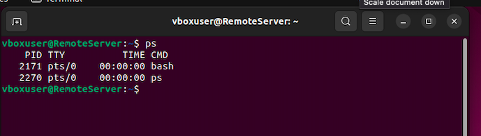

2. List All Processes for All Users:

```Bash
ps aux
```
The aux options display a more detailed list of all processes for all users.

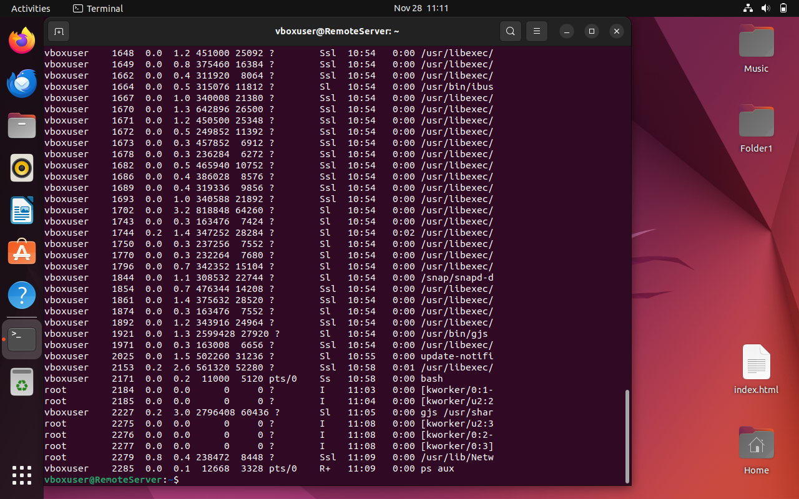

3. Show Process Tree (Hierarchy):

```Bash
ps auxf
```
The f option displays a tree-like structure, showing the parent-child relationship between processes.

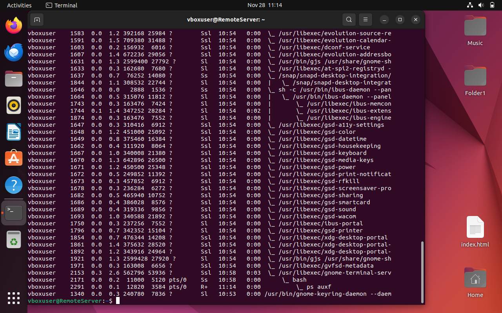

4. Display Full Format:

```Bash
ps -ef
```
The -e option selects all processes, and the -f option provides a full-format output with additional details.

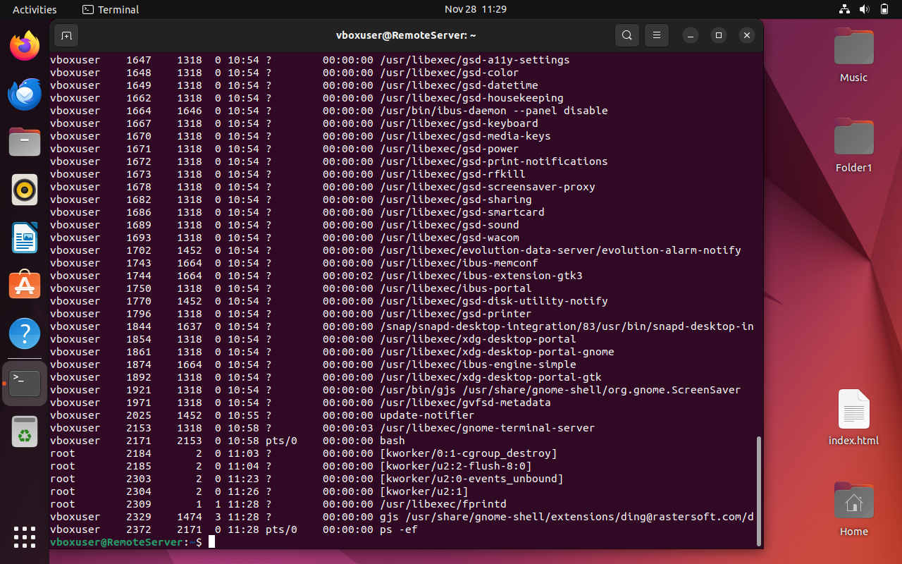


