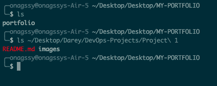

# FILE MANIPULATION USING LINUX

## 1. SUDO COMMAND

`sudo` short for `"superuser do"` is a command used in Unix-like operating systems to allow a permitted user to execute commands as the super user. Hence; It is used to perform tasks that require administrative or root permissions.

The general syntax:

```Bash
sudo (command e.g: apt upgrade)
```

It becomes:

```Bash
sudo apt upgrade
```

This command is used to upgrade the installed packages on your system to their latest versions.

- When using `sudo`, the system will prompt users to authenticate themselves with a password.  


## PWD COMMAND
`pwd` short for `print working directory`, displays the name of the current directory you are in. Simply entering pwd will return the full current path starting with a forward slash (e.g.: /home/ubuntu).
The pwd command uses the following syntax:
```Bash
pwd [option]
```
It has two (2) acceptable options:
- -L: Display the logical current working directory (default behavior).
- -P: Display the physical current working directory (the location of the current directory in the file system, which might differ from the logical directory due to symbolic links).


## CD COMMAND
`cd` short for `change directory`, allows you to change directories in Linux. It can be used as follows: 

To change to a specific directory:
```Bash
cd /path/to/directory
```
To move up one level in the directory hierarchy:
```Bash
cd ..
```
To go to your home directory:
```Bash
cd ~
```
To quickly return to the previous directory (where you were before the last cd):
```Bash
cd -
```


## LS COMMAND
`ls` short for `list`, is used to display files and folders within a specified location. It displays all of the contents in a directory.
If you are in a directory and you want to view its content, simply do `ls` like this e.g::
```Bash
ls 
```
or you can simply specify the path to the folder to want to view its content.
e.g.:
```Bash
ls ~/Desktop/Darey/DevOps-Projects/Project\ 1
```


You can also use this to list all the files in the sub-directories:
```Bash
ls -R
```
To show hidden files in addition to visible ones:
```Bash
ls -a
```
To show files in easily readable formats such as MB, GB and TB.
```Bash
ls -lh
```

