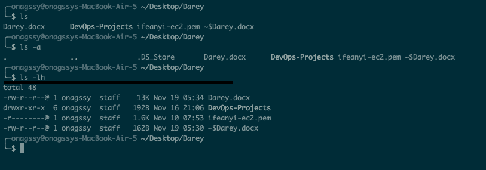

# FILE MANIPULATION USING LINUX

## 1. SUDO COMMAND

`sudo` short for `"superuser do"` is a command used in Unix-like operating systems to allow a permitted user to execute commands as the super user. Hence; It is used to perform tasks that require administrative or root permissions.

The general syntax:

```Bash
sudo (command e.g: apt upgrade)
```

It becomes:

```Bash
sudo apt upgrade
```

This command is used to upgrade the installed packages on your system to their latest versions.

- When using `sudo`, the system will prompt users to authenticate themselves with a password.  


## PWD COMMAND
`pwd` short for `print working directory`, displays the name of the current directory you are in. Simply entering pwd will return the full current path starting with a forward slash (e.g.: /home/ubuntu).
The pwd command uses the following syntax:
```Bash
pwd [option]
```
It has two (2) acceptable options:
- -L: Display the logical current working directory (default behavior).
- -P: Display the physical current working directory (the location of the current directory in the file system, which might differ from the logical directory due to symbolic links).


## CD COMMAND
`cd` short for `change directory`, allows you to change directories in Linux. It can be used as follows: 

To change to a specific directory:
```Bash
cd /path/to/directory
```
To move up one level in the directory hierarchy:
```Bash
cd ..
```
To go to your home directory:
```Bash
cd ~
```
To quickly return to the previous directory (where you were before the last cd):
```Bash
cd -
```


## LS COMMAND
`ls` short for `list`, is used to display files and folders within a specified location. It displays all of the contents in a directory.
If you are in a directory and you want to view its content, simply do `ls` like this e.g::
```Bash
ls 
```
or you can simply specify the path to the folder to want to view its content.
e.g.:
```Bash
ls ~/Desktop/Darey/DevOps-Projects/Project\ 1
```


You can also use this to list all the files in the sub-directories:
```Bash
ls -R
```


To show hidden files in addition to visible ones:
```Bash
ls -a
```


To show files in easily readable formats such as MB, GB and TB.
```Bash
ls -lh
```


## CAT COMMAND
`cat`:- short for `Concatenate` lists, combines, and writes file content to the standard output. To run the command, type cat followed by the file name and its extension. 

```Bash
cat file.txt
```


You can also merge two (2) files and store the output in a third file.

```Bash
cat file.txt file1.txt > mergedfile.txt
```


You can see that there is now a third file called `mergedfile.txt` and is has contents from `file.txt` and `file1.txt`.

You can also display the content in reverse order using:
```Bash
tac mergedfile.txt
```


## CP COMMAND

`cp` short for `copy` is used to copy files or directories from one location to another.
The basic syntax is:
```Bash
cp [options] source destination
```
* source: The file or directory you want to copy
* destination: Where you want to put the copied file(s) or directory.


1.  To copy a file to a different location:
```Bash
cp file.txt /path/to/destination/
```


Take note of the command at number 2 in the image above, you can see that after listing the content in Folder2 nothing was returned. You can see that after the cp command we now have file.txt in Folder2 as seen in number 4.

**Note that:** You can also copy multiple files to a directory using the same format above e.g:

```Bash
cp file.txt file1.txt /path/to/destination/
```


2. Copy a directory and its contents to a different directory/location:
```Bash
cp -r directory/ /path/to/destination/
```
The -r (or -R) option is used to copy directories recursively.


3. Preserve the original file attributes (timestamps, permissions):
```Bash
cp -p file.txt /path/to/destination/
```
The -p option preserves the specified attributes.

4. Force copy, overwrite destination if it exists:
```Bash
cp -f file.txt /path/to/destination/
```
The -f option forces the copy, overwriting the destination if it exists.

5. Interactive copy, prompt before overwriting:
```Bash
cp -i file.txt /path/to/destination/
```
The -i option prompts for confirmation before overwriting.

6. Copy all files in a directory to another directory:
```Bash
cp source_directory/* /path/to/destination/
```
This copies all files in source_directory to the specified destination.

## MV COMMAND
`mv` short for `move` is used to move and rename files and directories.   
**Note that**: it does not produce an output upon execution. 

`Syntax`:  
Simply type mv followed by the filename and the destination directory. E.g:

```Bash
mv file.txt /home/ubuntu/Commands
```

You can also use the mv command to rename a file. E.g:
```Bash
mv file1.txt file2000.txt
```

## MKDIR COMMAND
`mkdir` short for `make directory` - is used to create one or multiple directories at once and set permissions for each of them.  
**Note that**: the user executing this command must have the privilege to make a new folder in the parent directory or they may receive a permission denied error.   
**Syntax**: 
```Bash
mkdir [option] directory_name
```
Example:
1. Create a directory called "Music"
2. Create a directory called "Songs" inside "Music"


The `mkdir` command support many options such as: -  
`-p`: short for `parent` - this creates a directory between two existing folders e.g:  
```Bash
mkdir -p Music/2020/Songs
```
The above command will make the new "2020" directory.  
`-m`: sets the file permissions.
For instance; to create a directory with full read, write and execute permissions for all users, enter:
mkdir -m777 directory_name   
`-v`: prints a message for each created directory.

## RMDIR COMMAND
`rmdir` short for `remove directory` - is used to permanently delete an empty directory.  
**Note that:** to do this the user running this command should have sudo privileges in the parent directory. 

For example: if you want to remove an empty subdirectory named personal1 and its main folder mydir. 
```Bash
rmdir Person/personal1
```
## RM COMMAND
This is used to delete files within a directory.
```Bash
rm file.txt
```
To remove multiple files:
```Bash
rm file1.txt file2.txt file3.txt
```


Some acceptable option you can add:  
`-i`: prompts system confirmation before deleting a file.  
`-f`: allows the system to remove without a confirmation.  
`-r`: deletes files and directories recursively.

## TOUCH COMMAND
This command allows you to create an empty file or generate and modify a timestamp in the Linux Command Line.  
Lets create an html file named index.html in the Desktop directory.
```Bash
touch index.html
```


## LOCATE COMMAND
This command is used to search for a file or a directory.   
Adding the -i argument will turn off case sensitivity, so you can search for files even if you don't remember its exact name.   
Or you can say: It is used to quickly locate the path of a file or directory based on its name.   
Syntax:
```Bash
locate filename
```

The above command searches for the specified filename and prints the path(s) where it is located.

If you add the -i option, it makes the search case-insensitive:
```Bash
locate -i filename
```

## FIND COMMAND
It is used for searching and locating files and directories based on various criteria.
The basic syntax of the find command is as follows:
```Bash
find [path] [options] [expression]
```

`-path`: The starting directory for the search. If not specified, it defaults to the current directory.   
`-options`: Various options that modify the behavior of the find command.   
`-expression`: Specifies the search criteria.    
Some examples of using the find command:
```Bash
find /path/to/search -name filename
```
Basic usage:  
```Bash
find /path/to/search -name filename
```
This command searches for files and directories with the specified name (filename) under the specified path (/path/to/search).   

Search for Files Modified in the Last N Days:
```Bash
find /path/to/search -mtime -7
```

This command searches for files modified within the last 7 days.

Search for Files of a Specific Type:
```Bash
find /path/to/search -type f -name "*.txt"
```

This command searches for regular files with names ending in ".txt".

Search for Directories:
```Bash
find /path/to/search -type d -name "dirname"
```
This command searches for directories with the specified name (dirname).   

Search for Files Matching Multiple Criteria:
```Bash
find /path/to/search -type f -name "*.txt" -mtime -7
```
This command searches for regular files with names ending in ".txt" modified within the last 7 days.

## GREP COMMAND

## DF COMMAND
It is used to display information about the amount of disk space available and used on file systems.
The basic syntax of the df command is:   
```Bash
df [options] [file system(s)]
```

1. Display Disk Space Usage for All File Systems:
```Bash
df
```
This command displays information about disk space usage for all mounted file systems.

2. Display Disk Space Usage in Human-Readable Format:
```Bash
df -h
```
The -h option provides a human-readable output, showing sizes in kilobytes (KB), megabytes (MB), gigabytes (GB), etc.

3. Display Disk Space Usage for a Specific File System:
```Bash
df /dev/sda1
```
Replace /dev/sda1 with the specific file system you want to check.

## DU COMMAND
The du command is used to estimate the disk space used by files and directories.

The basic syntax of the du command is:
```Bash
du [options] [file(s) or directory]
```
Here are some common examples of using the du command:

1. Display Disk Usage for a Directory:

```Bash
du /path/to/directory
```
This command displays the disk space usage for the specified directory.

2. Display Disk Usage in Human-Readable Format:

```Bash
du -h /path/to/directory
```
The -h option provides a human-readable output, showing sizes in kilobytes (KB), megabytes (MB), gigabytes (GB), etc.

3, Display Total Disk Usage for Multiple Directories:

```Bash
du -h --max-depth=1 /dir1 /dir2
```
The --max-depth option limits the depth of the directory tree shown. In this example, it limits the output to the top-level directories.

4. Display Disk Usage for All Files in a Directory:
```Bash
du -h --max-depth=1 /path/to/directory/*
```
This command displays the disk space usage for all files directly under the specified directory.

5. Sort Output by Size:

```Bash
du -h --max-depth=1 /path/to/directory | sort -rh
```
This command sorts the output by size in descending order using the sort command.

6. Display Only the Total Disk Usage:

```Bash
du -sh /path/to/directory
```
The -s option provides a summary, showing only the total disk usage.

7. Display Disk Usage for Each Subdirectory Separately:

```Bash
du -h --max-depth=1 --separate-dirs /path/to/directory
```
The --separate-dirs option displays the disk space usage for each subdirectory separately.

## HEAD COMMAND
The head command is used to display the first part of a file.

## TAIL COMMAND
The tail command is used to display the last part of a file.

## DIFF COMMAND
The diff command is used to compare two files and display the differences between them.

## TAR COMMAND
The name "tar" stands for "tape archive," reflecting its historical use for backing up files to tape drives. The tar command is commonly used to create, manipulate, and extract archive files in various formats.


