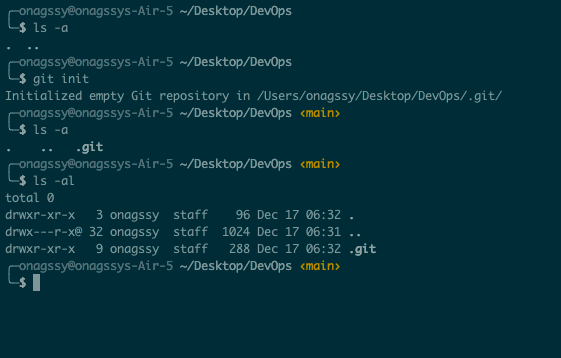
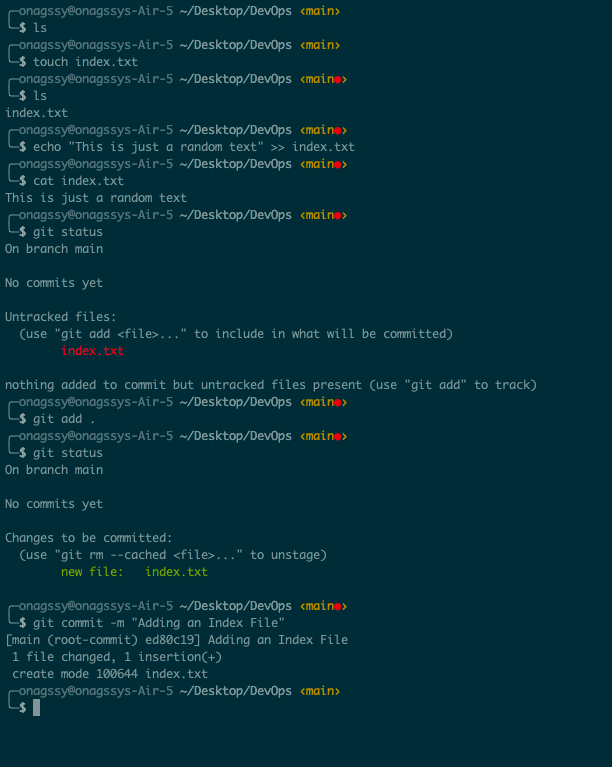
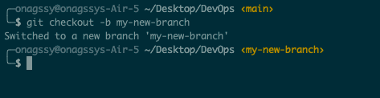
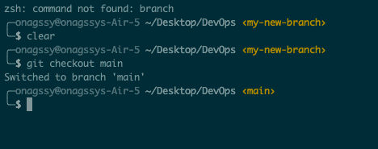
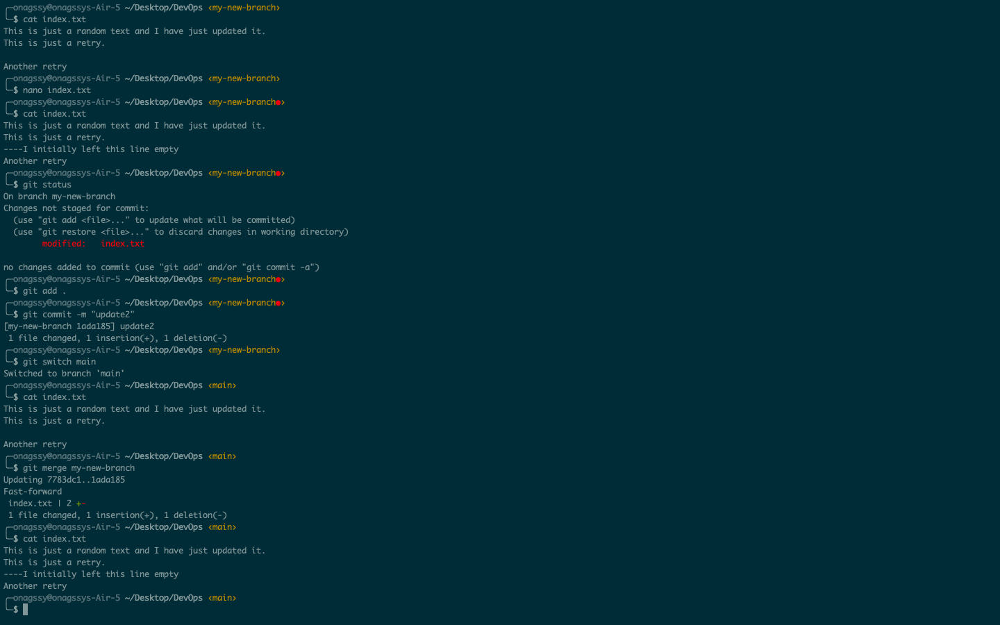

# INITIALIZING A GIT REPOSITORY AND MAKING COMMITS

## WHAT IS GIT?
Git is a free and open-source distributed version control system (VCS) that tracks changes in source code during software development. It was created by Linus Torvalds, the creator of the Linux operating system.

Git essentially solves the problem of sharing code efficiently and keeping track of changes made to source code.

Before git, there were other technologies that solves this problem and a good example is SVN. 

Subversion (SVN) is an open-source centralized version control system that manages changes to files and directories over time.

The way that SVN solved this problem posed some challenges. In SVN there exist a central source code repository. Every change by developers is made against this central repository. This setup makes it difficult to collaborate because changes can only be made one at a time. Secondly, if for any reason the central server goes down or is not reachable that effectively blocks the developers. 

Git adopted a different approach. It allows developers make their own copy of the central repository. That is why it is referred to as: **Distributed Version Control System**

## INITIALIZING A GIT REPOSITORY
### PREREQUISITE:
1. Install Git for your machine.
2. Install and Open your preferred terminal e.g: iTerm, GitBash etc.
3. Navigate to the directory where you want to create your repository using `cd` command in the terminal. 
```Bash
cd Desktop/Folder1
```
## Now Initialize a git repository 
1. Run the following commands on your terminal to create your working folder or directory e.g: DevOps folder:
```Bash
mkdir DevOps
```
2. cd into the working directory using this command:
```Bash
cd DevOps
```
3. While you are inside this working directory enter this command:
```Bash
git init
```
This will initialize a new git repository within your current directory. You can verify it by running: 
```Bash
ls -a
```



## Making your first commit
`Commit` is more or less like saving the changes you made to your files. Changes can be `adding`, `modifying`, or `deleting` files or text.   
When you make a commit, git takes a snapshot of the current state of your repository and saves a copy in the `.git` folder.   
Now let's make our first commit. To do so follow these steps:


- Inside your working directory create a file called index.txt using this command: 
```Bash
touch index.txt
```
- Write any sentence of your choice inside the text file. Afterwards save your changes.
- Add your changes to git staging area using this command:
```Bash
git add .
```
- To commit your changes to git, run the commnd:
```Bash
git commit -m "Adding an Index File"
```
The -m flag is used to provide a message. The commit message is a nice way of providing context about the commit. When writing a commit message, make it descriptive as possible. Let it explain why the commit was made.


## Working with Branches
Git allows us to work on multiple projects simultaneously without messing up our main codebase.   
Imagine you have a note book and you want to write different stories on different pages of your note book so that you do not mess up your previous note.    
Git branch is commonly used to develop new feature of your application. You will agree with me that the initial code is untested and as such can not be added to the code base of your live project.   
Git branch is also an important tool for collaboration within remote teams (developers working from different locations). They can make seperate branches while working on same feature. And at the end of the day, converge their code to one branch.

### Make your first git branch
To make a new branch run this command: 
```Bash
git checkout -b 
```
The -b flag helps you create and change into the new branch.   
With that said let's make our first branch following these steps:   
- Make a new branch by running this command:
```Bash 
git checkout -b my-new-branch
```
 

## List your git Branches
Use the command below to list the branches on your local git repository:
```Bash
git branch
```
 

## Change into an old branch
To change into an old or existing branch use the command below:
```Bash
git checkout <branch-name>
```


## Merging a branch into another branch
Let's say we have two branches "main" and "my-new-branch". And we want to add the content of branch "my-new-branch" into "main". First we change into branch "main" and run the git command below:
```Bash
git merge my-new-branch
```


## Deleting a git branch
When new feature is added to an application, its often done in a feature branch. Usually this feature branch is deleted when the code must have been tested and merged into a staging or dev environment depending on the branch strategy of the team.   
Git branch can be deleted with the command below:   
```Bash
git branch -d <branch_name>
```
## Collaboration and Remote Repositories
GitHub is a web based platform where git repositories are hosted. This way, it becomes available in the public internet(it is possible to create private repository and limit who has access to the repo). Remote Teams can now view, update and make changes in the same repository.

Follow the below steps to create your repository:

1. First create a gitHub account via this link https://github.com/
2. Enter your email, password, username.
3. Click on Verify button to verify your identity
4. Click on create and enter the activation code sent to your email on the textboxes.
5. Select number of Users and github plans and click on continue for free.
6. Click on the plus sign at the top right corner of your github account to create a new Repository, then fill out the forms and add the README.md (tick the box) and click on create.
7. Add a remote repository to your local repository by running:
```Bash
 git remote add origin <link to github repo>
```
8. After making changes, you can commit back to the Github repository by running: 
```Bash
git push
```
9. You can clone remote Git repo by running: 
```Bash
git clone <link to remote repo>
```

## **Branch Management and Tagging**

### **Introduction to Markdown Syntax**
Markdown syntax is used for formatting plain text. It allows you to add formatting elements to your texts without using complex HTML or orther formatting languages. It is commonly used for creating documents, README.md files etc.
Examples:
1. **Headings**: to create heading, the number of hash symbol determines the level of heading.
```console
# Heading 1 
## Heading 2 
### Heading 3
```
Output:
# Heading 1
## Heading 2
### Heading 3


2. **Emphasis**
```console
*italic* or _italic_
**bold** or __bold__
```
Output: 

*italic* or _italic_
**bold** or __bold__

3. Lists: support ordered and unordered lists.
```console
- Item 1
- Item 2
- Item 3
1. First item
2. Second item
3. Third item


```
Output:
- Item 1
- Item 2
- Item 3
1. First item
2. Second item
3. Third item


4. Links: to create hyperlinks, use square brackets.
```console
[visit darey.io](https://www.darey.io)
```
Output:
[visit darey.io](https://www.darey.io)


5. Images: use exclamation mark followed by brackets for alt text and parentheses containing the image URL.

```console

```


6. Code: use backticks
```console
`console.log('Welcome to darey.io')`
```
Output:
`console.log('Welcome to darey.io')`


Here is a link for more insight on https://learn.microsoft.com/en-us/contribute/content/markdown-reference 

Thank you.